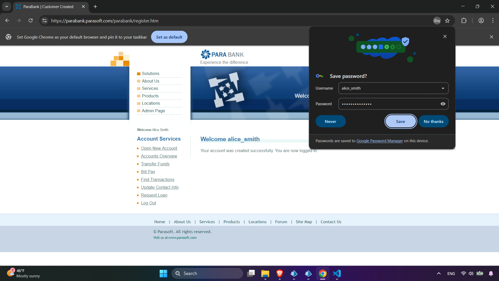

# Task Completion Documentation

Tried doing in BP, moved to python due to time constraints. Discussion 

1. First of all I downloaded learning edition for BP.
2. Started discovering application.
3. Chose to start creating registration process inside object directory.
4. Creating a flow to register users.
    1. Get the table from csv.
        1. Encountered numerous errors with uploading csv. Tried to clean the csv, standardized date formats, switched types, created testing csv with one row, one column. Discovered that I need Utility - File system, got it from digital exchange(“.bpobject”), uploaded and it worked fine.
    2. Navigation and attachment. 
        1. Encountered errors that my application isn’t connected, then attached it in application modeler and it worked.
    3. Created a loop with the collection items, fill in information and then submit. 
        1. Errors mostly with the unfilled data. For the MVP filled with “undefined”
5. Registration worked, the password is correct. (for one user)

The problem with current flow that it doesn’t exit back to register other users or goes further with the process. 

- Decision to make whether I move further with BP and end the user story entirely with BP or create a separate flow with technology I know (Python) to confidently end the task. (1 day passed)
    - Decided to move on and try to do it with BP

1. Discovered process and object principles - Creating process and object

When run with the process with object spotted interesting behavior.

When running the flow with the “Main Page” within process the flow breaks after registering the Bob.

1. When running only the object without starting the process it gets through all.

Decided to make everything inside the object studio.

1. After the registration the system automatically logs in so I should create another object that opens account, fills in the form and output it into excel.  (2 day)

Due to learning curve and time constraint I won’t manage to make it properly and nicely inside BP - pivoting to known technology python( playwright, pandas)(3rd day).

1. Create consecutive script with playwright(took xpath from BP) 

b. Moving towards making it work with data with test prefix.

c. Prepared whole script to run on give data

1. Whole code:
    
    
    
    
    
    
    

Discussion:

- Mistakes:
    - Started from Blue prism instead of python - learning curve is high, took a lot of time, had to create a solution then move towards experimenting with BP.
    - Started hands on discovering the application, without finding a good study material for second day.
- Exception management:
    - Added a little of exception management logic for eve - she won’t apply for the loan and for the already registered users,  robot just logs in as the current user and moves on with the scenario.
- Current solution(python):
    - There is numerous ways of improvement i.e. some fields are undefined and the website validation doesn’t let to register. It is best not to register them as it is banking system or to communicate for the clients that each field need to be filled.
    - The script can be transformed into a larger one with error handling, and logging. With security measures data can be encrypted and decrypted at the run time,  configure hardcoded values into separate config file like 10 000.

There is .webm video of the script performance